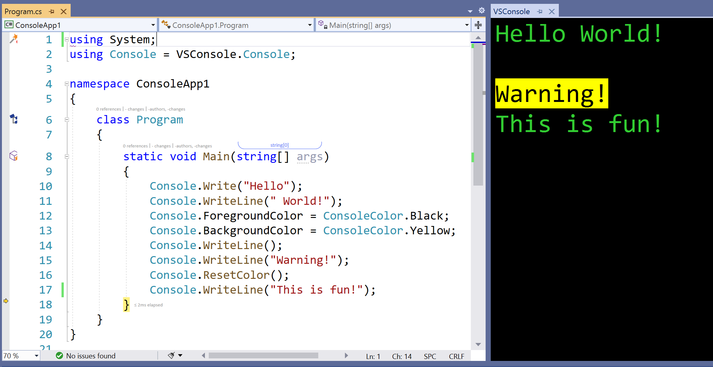
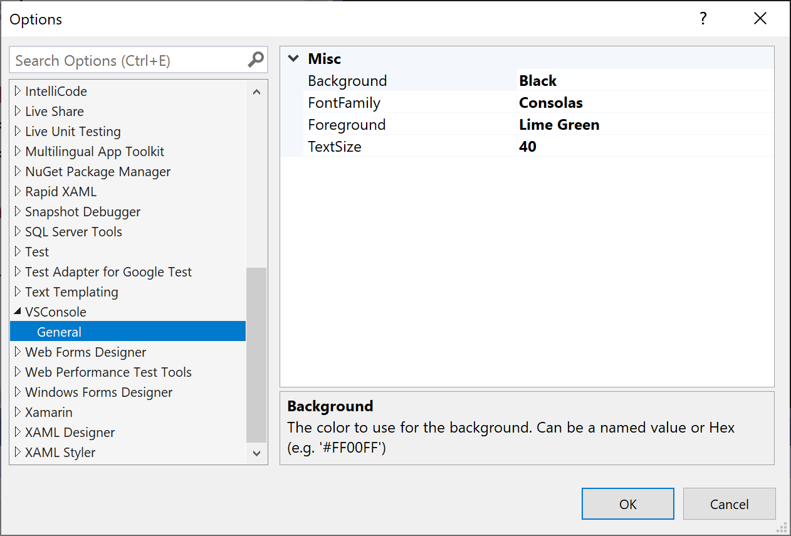

# VSConsole

Improve your debugging and presentation experience by seeing the Console output inside Visual Studio.

Download the extension from the VS Marketplace [for VS2022](https://marketplace.visualstudio.com/items?itemName=MattLaceyLtd.VSConsole) or [VS2019](https://marketplace.visualstudio.com/items?itemName=MattLaceyLtd.VSConsole2019) AND install the [NuGet package](https://www.nuget.org/packages/VSConsole/).

-------------------------------------

It relies on the use of a [NuGet package](https://www.nuget.org/packages/VSConsole/) that contains a class `Console` that has a matching API signature as `System.Console`.
Use it in the same way but when debugging, what is displayed in the running command window will also show in the VSConsole window inside Visual Studio.

Customize the display as you want it: colors; font; size.

You can access the settings via Tools > Options > VSConsole, or right click on the window and select `Options`.

To add the VSConsole window (if not shown), you'll find it under View > Other Windows > VSConsole.

Want more? [Raise an issue](https://github.com/mrlacey/VSConsole/issues/new).

Like this?
- Star this repo :star:
- [Sponsor me](https://github.com/sponsors/mrlacey) :heart:
- [Leave a review](https://marketplace.visualstudio.com/items?itemName=MattLaceyLtd.VSConsole&ssr=false#review-details)
- [tweet at me](https://twitter.com/mrlacey) :bird:
